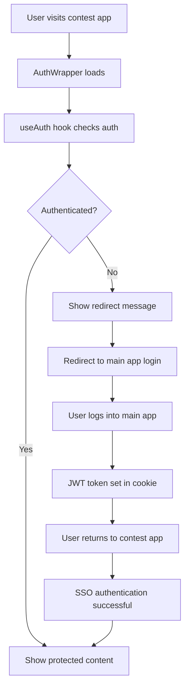

# Contest App Authentication System

## 🔐 Overview

The contest app uses a Single Sign-On (SSO) system that integrates with the main Sacavia app. When users are not authenticated, they are automatically redirected to the main app's login page.

## 🚀 How It Works

### 1. **Authentication Check**
- When a user visits any protected page in the contest app, the `AuthWrapper` component loads
- The `useAuth` hook automatically checks authentication status via `/api/auth/me`
- If no JWT token is found, the user is considered unauthenticated

### 2. **Automatic Redirect**
- Unauthenticated users are automatically redirected to the main app's login page
- The redirect URL includes a `returnTo` parameter with the contest app URL
- Example: `https://sacavia.com/login?returnTo=https://vote.sacavia.com/`

### 3. **SSO Authentication**
- After logging into the main app, users get a JWT token in the `payload-token` cookie
- The contest app reads this cookie and verifies the JWT using the shared `PAYLOAD_SECRET`
- Users are automatically authenticated in the contest app

## 🛡️ Protected Routes

The following pages require authentication:

- **Home Page** (`/`) - Main contest page with featured entries
- **Leaderboard** (`/leaderboard`) - All contest entries with voting
- **Locations** (`/locations`) - All locations with search and filters

### Public Pages (No Authentication Required)

- **How to Enter** (`/how-to-enter`) - Informational page about contest rules

## 🔧 Implementation Details

### AuthWrapper Component

```tsx
<AuthWrapper requireAuth={true}>
  <YourProtectedContent />
</AuthWrapper>
```

**Features:**
- Shows loading state while checking authentication
- Displays redirect message for unauthenticated users
- Automatically redirects to main app login
- Renders protected content for authenticated users

### useAuth Hook

```tsx
const { isAuthenticated, isLoading, user, login, logout } = useAuth();
```

**Features:**
- Automatic authentication checking
- Auto-redirect on authentication failure
- Login/logout functionality
- Session management

### Authentication Flow



## 🌐 Environment Configuration

### Required Environment Variables

```bash
# Main App Configuration
NEXT_PUBLIC_MAIN_APP_URL=https://sacavia.com
NEXT_PUBLIC_CONTEST_APP_URL=https://vote.sacavia.com

# SSO Configuration (Must match main app)
PAYLOAD_SECRET=your-shared-secret
SSO_JWT_SECRET=your-shared-secret
```

### Cookie Configuration

```typescript
// Production cookie settings
cookieOptions: {
  secure: true,           // HTTPS only
  sameSite: 'lax',       // Cross-site requests
  httpOnly: true,        // Server-side only
  domain: '.sacavia.com' // Shared domain
}
```

## 🧪 Testing

### Manual Testing

1. **Visit contest app without being logged in:**
   ```
   https://vote.sacavia.com
   ```
   - Should show loading state
   - Then show redirect message
   - Then redirect to main app login

2. **Login to main app:**
   ```
   https://sacavia.com/login
   ```
   - Complete login process
   - JWT token is set in cookie

3. **Return to contest app:**
   ```
   https://vote.sacavia.com
   ```
   - Should automatically authenticate
   - Show protected content

### API Testing

```bash
# Check authentication status
curl http://localhost:3001/api/auth/me

# Expected response when not authenticated:
{"isAuthenticated":false,"user":null,"message":"Not authenticated"}

# Expected response when authenticated:
{"isAuthenticated":true,"user":{"id":"user-id"},"session":{"createdAt":1234567890,"isLoggedIn":true}}
```

## 🚨 Troubleshooting

### Common Issues

1. **Redirect Loop**
   - Check that `NEXT_PUBLIC_MAIN_APP_URL` is correct
   - Verify main app login page is accessible
   - Ensure return URL is properly encoded

2. **SSO Not Working**
   - Verify `PAYLOAD_SECRET` matches between apps
   - Check cookie domain configuration
   - Ensure both apps are on same root domain

3. **Authentication Check Failing**
   - Check `/api/auth/me` endpoint is working
   - Verify JWT token is being read from cookies
   - Check server logs for authentication errors

### Debug Mode

Enable debug logging by checking browser console for:
- `🔐 User not authenticated, redirecting to login...`
- `🔐 Redirecting to login: [URL]`
- `✅ Main app JWT token found: [user-id]`

## 📱 Production Deployment

### Domain Setup

- **Main App**: `sacavia.com`
- **Contest App**: `vote.sacavia.com` (subdomain)

### SSL/HTTPS

- Both apps must use HTTPS in production
- Secure cookies require HTTPS
- SSL certificates must be valid for both domains

### Environment Variables

Set these in your production environment:

```bash
NEXT_PUBLIC_MAIN_APP_URL=https://sacavia.com
NEXT_PUBLIC_CONTEST_APP_URL=https://vote.sacavia.com
PAYLOAD_SECRET=your-production-secret
SSO_JWT_SECRET=your-production-secret
SESSION_PASSWORD=your-super-secure-session-password
```

## 🔒 Security Considerations

1. **JWT Secret**: Must be identical between main app and contest app
2. **Cookie Security**: Use secure, httpOnly cookies in production
3. **Domain Validation**: Ensure proper domain configuration for cookie sharing
4. **HTTPS Only**: All authentication must happen over HTTPS in production
5. **Token Expiration**: JWT tokens have expiration times for security

## 📊 Monitoring

Monitor these endpoints for authentication health:

- `GET /api/auth/me` - Authentication status
- `GET /api/contest/stats` - Contest functionality
- `POST /api/contest/upvote` - Voting functionality

Check server logs for authentication-related errors and redirect patterns.
